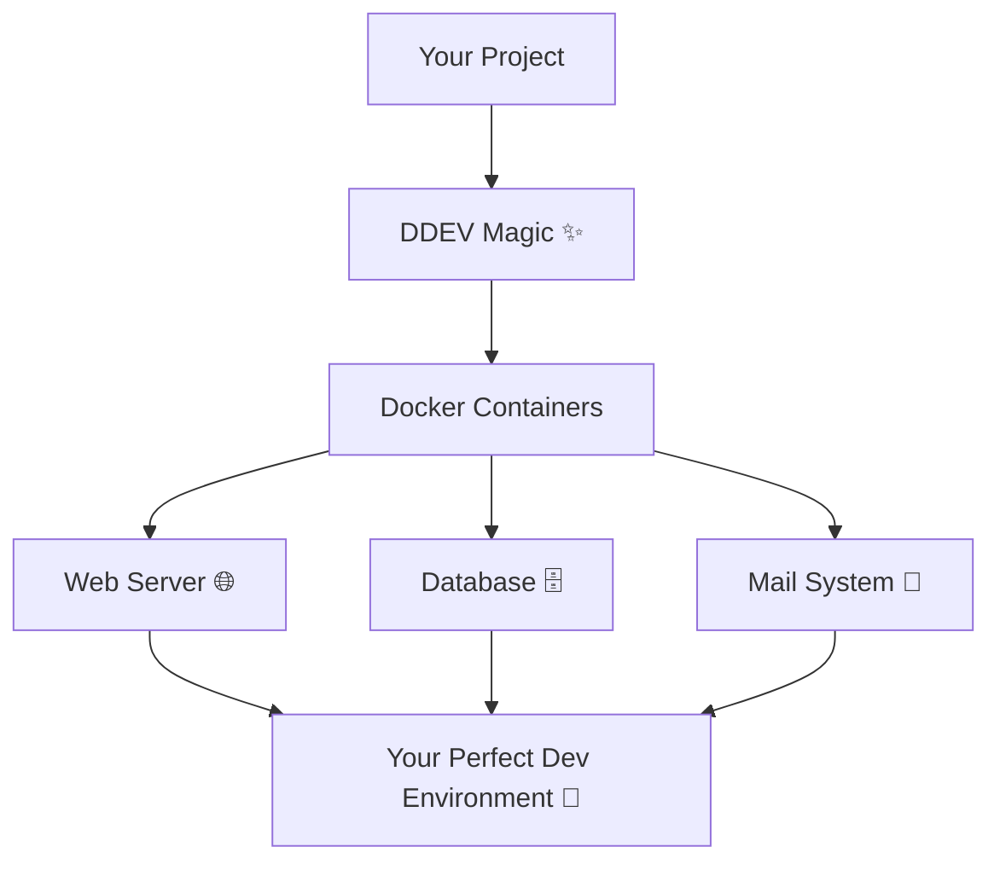
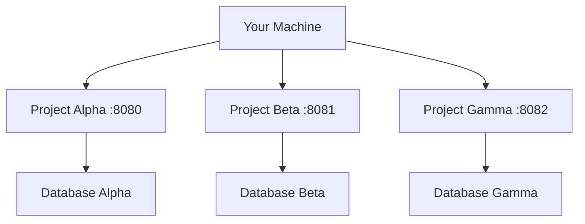

## _Your Journey from Zero to Docker Development Hero_
> **📖 The Developer's Tale**  
> _Imagine this: It's Monday morning, and you need to set up a new WordPress project. Your colleague says "just install XAMPP," but you've been there before – the endless configuration, the version conflicts, the "it works on my machine" syndrome. What if I told you there's a better way?_

## 📚 Quick Reference Guide

### 🎯 Essential Commands Cheat Sheet

```bash
# Project Lifecycle
ddev config          # 🔧 Initialize project
ddev start           # 🚀 Start containers  
ddev stop            # 🛑 Stop containers
ddev restart         # 🔄 Restart containers
ddev delete          # 🗑️ Delete project containers

# Information & Status
ddev list            # 📋 List all projects
ddev describe        # 📊 Project details
ddev status          # 🔍 Container status

# Container Interaction  
ddev ssh             # 💻 Enter web container
ddev ssh -s db       # 🗄️ Enter database container
ddev exec <command>  # ⚡ Execute command

# Database Operations
ddev import-db       # 📥 Import database
ddev export-db       # 📤 Export database  
ddev mysql           # 🔍 MySQL client

# Logs & Debugging
ddev logs           # 📜 View logs
ddev logs -f        # 📜 Follow logs
ddev xdebug on      # 🐞 Enable Xdebug
```

### 🎨 Configuration Quick Templates

#### WordPress

```yaml
name: wordpress-site
type: wordpress  
docroot: web
php_version: "8.1"
```

#### Laravel

```yaml
name: laravel-app
type: laravel
docroot: public  
php_version: "8.2"
```

#### Drupal

```yaml
name: drupal-site
type: drupal9
docroot: web
php_version: "8.1"
```

---

## 🎯 Chapter 1: The DDEV Story

### What is DDEV?

**DDEV** (Docker Development Environment) is your friendly neighborhood superhero for local development. Think of it as a magic wand that transforms messy, manual server setups into clean, consistent Docker containers.



### 🎪 The Three Pillars of DDEV

|🏛️ Pillar|Description|Benefit|
|---|---|---|
|**Consistency**|Same environment everywhere|No more "works on my machine"|
|**Simplicity**|One command to rule them all|Focus on code, not config|
|**Flexibility**|Supports 10+ frameworks|One tool for all projects|

> **💡 Quick Insight**  
> DDEV is like having a professional DevOps engineer who sets up your entire infrastructure with a single command!

---

## 🧠 Chapter 2: Understanding the Magic

### 🏗️ The DDEV Architecture

```
┌─────────────────────────────────────────┐
│              Your Machine               │
├─────────────────────────────────────────┤
│  ┌─────────┐  ┌─────────┐  ┌─────────┐  │
│  │   Web   │  │Database │  │ Mailhog │  │
│  │Container│  │Container│  │Container│  │
│  │ 🌐 PHP   │  │  MySQL  │  │  SMTP   │  │
│  │ Apache  │  │ MariaDB │  │  Test   │  │
│  └─────────┘  └─────────┘  └─────────┘  │
│              Docker Network             │
└─────────────────────────────────────────┘
```

### 🎯 Core Concepts

#### 1. **Projects** 📁

- Each project = one folder on your machine
- Contains your code + `.ddev/` configuration
- Completely isolated from other projects

#### 2. **Containers** 🐳

```bash
# The Container Family
Web Container    # 🌐 Your PHP + Apache/Nginx home
DB Container     # 🗄️ Your data warehouse  
Mail Container   # 📧 Your email testing lab
```

#### 3. **Configuration Files** ⚙️

```
project-folder/
├── .ddev/
│   ├── config.yaml           # 🎛️ Main control panel
│   ├── docker-compose.*.yaml # 🔧 Custom overrides
│   └── hooks/                # 🪝 Automation scripts
└── your-code/                # 💻 Your masterpiece
```

---

## ⚡ Chapter 3: Getting Started

### 🚀 The Launch Sequence

```
		[Install Docker] + [Install DDEV]
		            ↓
		   [Navigate to Project]
		            ↓
		    [Run ddev config]
		            ↓
		    [Run ddev start]
		            ↓
		        [🎉 Success!]

```

### Step 1: Prerequisites Checklist ✅

- [ ] **Docker Desktop** installed ([Get it here](https://www.docker.com/products/docker-desktop))
- [ ] **DDEV** binary installed ([Installation guide](https://ddev.readthedocs.io/en/stable/#installation))

### Step 2: Installation Verification

```bash
# Check if everything is ready
ddev version
```

> **Expected Output:**
> 
> ```
> ddev version v1.22.0
> ```

### Step 3: Your First Project 🎯

```bash
# Navigate to your project folder
cd my-awesome-project

# The magic begins
ddev config
```

**Interactive Setup Experience:**

```
Project name: my-awesome-project
Docroot location: [current directory]
Project Type: wordpress
```

---

## 🛠️ Chapter 4: Essential Commands

### 🎮 The Command Control Center

|Command|What It Does|When to Use|
|---|---|---|
|`ddev config`|🔧 Setup wizard|Starting new projects|
|`ddev start`|🚀 Launch containers|Beginning work session|
|`ddev stop`|🛑 Stop containers|End of day|
|`ddev restart`|🔄 Refresh environment|After config changes|
|`ddev ssh`|💻 Enter container shell|Running server commands|
|`ddev exec`|⚡ Run quick commands|One-off tasks|

### 🎯 Command Deep Dive

#### `ddev start` - Your Project Launcher

```bash
ddev start
```

```
Starting my-project...
Project can be reached at:
🌐 https://my-project.ddev.site
🌐 https://127.0.0.1:8443
📧 Mailhog: http://my-project.ddev.site:8025
```

#### `ddev ssh` - Your Container Terminal

```bash
ddev ssh
# Now you're inside the container! 
$ ls -la
$ composer install
$ npm run build
```

#### `ddev exec` - Quick Commands

```bash
# WordPress CLI
ddev exec wp plugin list

# Composer
ddev exec composer require symfony/console

# Custom scripts
ddev exec ./my-deploy-script.sh
```

### 🔍 Status and Information Commands

```bash
# See project details
ddev describe

# List all projects
ddev list

# View container logs
ddev logs -s web
ddev logs -s db
```

---

## ⚙️ Chapter 5: Configuration Mastery

### 🎛️ The config.yaml Control Panel

Your `.ddev/config.yaml` is your project's DNA:

```yaml
# Project Identity
name: my-project
type: wordpress
docroot: web
php_version: "8.1"
webserver_type: nginx-fpm

# Network Configuration  
router_http_port: "80"
router_https_port: "443"

# Development Features
xdebug_enabled: false
use_dns_when_possible: true

# Custom Configuration
hooks:
  post-start:
    - exec: "composer install"
    - exec: "npm install"
```

### 🎨 Project Types Gallery

|Type|Description|Perfect For|
|---|---|---|
|`wordpress`|🎪 WordPress magic|Blogs, CMS sites|
|`drupal9`|🏛️ Drupal power|Enterprise sites|
|`laravel`|⚡ Laravel elegance|Modern PHP apps|
|`typo3`|🎭 TYPO3 enterprise|Corporate websites|
|`php`|🐘 Generic PHP|Custom applications|

### ⚡ Quick Configuration Examples

#### WordPress Setup

```bash
ddev config --project-type=wordpress --php-version=8.1 --docroot=web
```

#### Laravel Setup

```bash
ddev config --project-type=laravel --php-version=8.2 --docroot=public
```

---

## 🔄 Chapter 6: Advanced Workflows

### 💾 Database Operations

#### Import Your Database

```bash
# From SQL file
ddev import-db --src=database.sql

# From compressed backup
ddev import-db --src=backup.sql.gz

# From URL
ddev import-db --src=https://example.com/backup.sql.gz
```

#### Export Your Database

```bash
# Standard export
ddev export-db --file=backup.sql

# Compressed export
ddev export-db --file=backup.sql.gz --gzip
```

### 🌐 Multiple Projects Mastery



> **💡 Pro Tip**  
> DDEV automatically assigns different ports to avoid conflicts. Run multiple projects simultaneously without breaking a sweat!

### 🔧 Custom Services

Add Redis to your project:

```yaml
# .ddev/docker-compose.redis.yaml
version: '3.6'
services:
  redis:
    image: redis:alpine
    container_name: ddev-${DDEV_SITENAME}-redis
    labels:
      com.ddev.site-name: ${DDEV_SITENAME}
    ports:
      - "6379"
```

---

## 🐛 Chapter 7: Debugging Like a Pro

### 🔍 Log Investigation

```bash
# Web server logs
ddev logs -s web

# Database logs  
ddev logs -s db

# Follow logs in real-time
ddev logs -f -s web
```

### 🐞 Xdebug Setup

1. **Enable in config.yaml:**

```yaml
xdebug_enabled: true
```

2. **Restart project:**

```bash
ddev restart
```

3. **Configure your IDE:**

- **PHPStorm:** Port 9003, path mappings
- **VSCode:** Install PHP Debug extension

### 🚨 Common Issues & Solutions

|Problem|Symptoms|Solution|
|---|---|---|
|**Port Conflicts**|`Port already in use`|`ddev stop --all`|
|**DNS Issues**|Can't reach `.ddev.site`|Check router settings|
|**Container Problems**|Services not starting|`ddev restart`|
|**Permission Issues**|File access denied|Check Docker file sharing|

---

## 🎪 Chapter 8: Power Features

### 📧 Mailhog - Email Testing Paradise

Every DDEV project includes Mailhog for email testing:

```
📧 Access: http://your-project.ddev.site:8025
✅ Catches all outgoing emails
🔍 Web interface for email inspection
🧪 Perfect for testing registration emails, notifications
```

### 🗄️ Database Management

#### Built-in PHPMyAdmin

```bash
# Add to .ddev/docker-compose.phpmyadmin.yaml
ddev get drud/ddev-phpmyadmin
ddev restart
```

#### Direct Database Access

```bash
# MySQL command line
ddev mysql

# Execute SQL directly
ddev mysql -e "SHOW DATABASES;"
```

### 🎯 Performance Optimization

```yaml
# .ddev/config.yaml
performance_mode: mutagen  # For macOS/Windows
upload_dir: .ddev/uploads  # Custom upload handling
```

---

## 📝 Chapter 9: Real-World Example

### 🏗️ Building a WordPress Site from Scratch

Let's create a complete WordPress development environment:

#### Step 1: Project Initialization

```bash
mkdir my-wordpress-blog
cd my-wordpress-blog
ddev config --project-type=wordpress --docroot=web --create-docroot
```

#### Step 2: Start and Install WordPress

```bash
ddev start
ddev exec wp core download
ddev exec wp config create --dbname=db --dbuser=db --dbpass=db --dbhost=db
```

#### Step 3: Complete Installation

```bash
ddev exec wp core install \
  --url=my-wordpress-blog.ddev.site \
  --title="My Amazing Blog" \
  --admin_user=admin \
  --admin_password=admin123 \
  --admin_email=admin@example.com
```

#### Step 4: Install Theme and Plugins

```bash
# Install a theme
ddev exec wp theme install twentytwentythree --activate

# Install essential plugins
ddev exec wp plugin install yoast-seo contact-form-7 --activate
```

#### Final Result 🎉

```
🌐 Site: https://my-wordpress-blog.ddev.site
👨‍💻 Admin: https://my-wordpress-blog.ddev.site/wp-admin
📧 Emails: http://my-wordpress-blog.ddev.site:8025
```

---

## 🚀 Chapter 10: Advanced Customization

### 🪝 Automation with Hooks

Create `.ddev/hooks/post-start/setup.sh`:

```bash
#!/bin/bash
echo "🚀 Running post-start setup..."

# Install dependencies
composer install
npm install

# Build assets
npm run build

# Clear caches
wp cache flush

echo "✅ Setup complete!"
```

### 🐳 Custom Docker Images

```yaml
# .ddev/config.yaml
web_environment:
  - NODE_VERSION=18

hooks:
  post-start:
    - exec: "curl -o- https://raw.githubusercontent.com/nvm-sh/nvm/v0.39.0/install.sh | bash"
```

### 🌟 Advanced Docker Compose

```yaml
# .ddev/docker-compose.elasticsearch.yaml
version: '3.6'
services:
  elasticsearch:
    image: elasticsearch:7.17.0
    container_name: ddev-${DDEV_SITENAME}-elasticsearch
    environment:
      - discovery.type=single-node
      - "ES_JAVA_OPTS=-Xms512m -Xmx512m"
    ports:
      - "9200"
    labels:
      com.ddev.site-name: ${DDEV_SITENAME}
```

---


## 🎯 Best Practices & Pro Tips

### ✅ Do's

- ✅ **Version Control**: Always commit `.ddev/config.yaml`
- ✅ **Unique Names**: Use descriptive, unique project names
- ✅ **Regular Updates**: Keep DDEV updated (`ddev version`)
- ✅ **Clean Shutdowns**: Use `ddev stop` before system shutdown
- ✅ **Resource Management**: Stop unused projects

### ❌ Don'ts

- ❌ Don't commit `.ddev/.global_commands/`
- ❌ Don't manually edit `docker-compose.yaml`
- ❌ Don't use spaces in project names
- ❌ Don't run multiple projects on same port
- ❌ Don't ignore Docker resource limits

### 🚀 Power User Shortcuts

```bash
# Aliases for efficiency
alias ds="ddev start"
alias dss="ddev ssh"
alias dl="ddev list"
alias dr="ddev restart"

# Quick project switching
function ddev-cd() {
    cd ~/projects/$1 && ddev start
}
```

---

## 🎉 Conclusion: You're Now a DDEV Hero!

Congratulations! You've journeyed from DDEV zero to hero. You now have the power to:

🚀 **Spin up development environments in seconds**  
🔧 **Configure complex stacks with simple YAML**  
🐛 **Debug like a professional**  
🎪 **Handle multiple projects effortlessly**  
⚡ **Automate repetitive tasks**

### 🌟 Your Next Steps

1. **Practice**: Set up your current project with DDEV
2. **Explore**: Try different project types
3. **Customize**: Add your own hooks and services
4. **Share**: Help teammates adopt DDEV
5. **Contribute**: Join the DDEV community

### 📚 Additional Resources

- 📖 [Official DDEV Documentation](https://ddev.readthedocs.io/)
- 💬 [DDEV Discord Community](https://discord.gg/5wjP76mBJD)
- 🐛 [GitHub Issues](https://github.com/drud/ddev/issues)
- 📺 [Video Tutorials](https://www.youtube.com/results?search_query=ddev+tutorial)

---

> **🎭 "The best development environment is the one you don't have to think about."**  
> _— Every Developer Ever_

**Happy coding with DDEV! 🐳✨**