> **🏛️ The System Administrator's Tale**  
> _Picture this: You've just installed your first Arch Linux system. Everything's running smoothly until you realize... you're stuck as root. Your colleague says "just create a user," but you've heard horror stories about broken permissions and security nightmares. What if there was a way to master user management with confidence?_

Welcome to your Linux Users adventure – where secure, organized user management becomes second nature! 🚀

---
## 🎭 Chapter 1: The Identity Story

### What is a Linux User?

In the Linux universe, a **user** is more than just a person – it's an **identity** that represents anyone or anything interacting with your system. Think of it as a digital passport that grants specific rights and access.

```mermaid
graph TD
    A[Linux System] --> B[User Identity 🆔]
    B --> C[Human User 👤]
    B --> D[Service Process 🤖]
    B --> E[System Process ⚙️]
    C --> F[Personal Files & Apps]
    D --> F1[Database Service]
    E --> F2[System Maintenance]
```



### 🎪 The Three Pillars of User Management

|🏛️ Pillar|Description|Why It Matters|
|---|---|---|
|**Security**|Access control & permissions|Prevents unauthorized access|
|**Organization**|Logical separation of resources|Keeps system clean & manageable|
|**Accountability**|Track who did what|Essential for troubleshooting|

> **💡 Quick Insight**  
> Every file, every process, every action in Linux has an owner. Understanding users means understanding the entire security model!

---

## 🏗️ Chapter 2: The User Architecture

### 🎯 The Linux Identity System

```
┌─────────────────────────────────────────────────┐
│                 Linux System                    │
├─────────────────────────────────────────────────┤
│  👤 Users         👥 Groups      🔐Permissions  
│  ┌─────────┐     ┌─────────┐      ┌─────────┐   │
│  │  User   │────▶│ Primary │      │   rwx   │   │
│  │  UID    │     │  Group  │      │  421    │   │
│  │ 1001    │     │  GID    │      │ Octal   │   │
│  └─────────┘     └─────────┘      └─────────┘   │
│       │               │                │        │
│       └───────────────┼────────────────┘        │
│                       ▼                         │
│               File Ownership                    │
│              & Access Control                   │
└─────────────────────────────────────────────────┘
```

### 🧬 User DNA Components

Every Linux user has these essential components:

```bash
# User Identity Recipe
Username    # 👤 Human-readable name
UID         # 🔢 Unique numeric ID  
GID         # 👥 Primary group ID
Home Dir    # 🏠 Personal workspace
Shell       # 💻 Command interpreter
Password    # 🔐 Authentication key
```

---

## 👥 Chapter 3: Types of Digital Citizens

### 🤖 System Users (The Worker Bees)

**Characteristics:**

- UID: `0-999` (reserved range)
- Purpose: Run system services
- Home: Usually `/var/lib/servicename` or none
- Shell: Often `/sbin/nologin` (no interactive login)

```mermaid
graph LR
    A[System User] --> B[Web Server 🌐]
    A --> C[Database 🗄️]
    A --> D[Mail Service 📧]
    B --> E[apache/nginx]
    C --> F[mysql/postgres]
    D --> G[postfix/dovecot]
```



**Examples:**

```bash
www-data    # Web server processes
mysql       # Database service
mail        # Mail system
nobody      # Minimal privilege user
```

### 👤 Human Users (The Explorers)

**Characteristics:**

- UID: `1000+` (Arch Linux standard)
- Purpose: Interactive system use
- Home: `/home/username`
- Shell: `/bin/bash`, `/bin/zsh`, etc.

```bash
# Human User Profile
alice:x:1001:1001:Alice Smith:/home/alice:/bin/bash
│     │ │    │    │           │           └── Login shell
│     │ │    │    │           └── Home directory  
│     │ │    │    └── Full name (GECOS)
│     │ │    └── Primary group ID
│     │ └── User ID
│     └── Password placeholder
└── Username
```

### 👑 The Superuser (root)

```
🚨 ROOT USER POWERS 🚨
├── UID: 0 (Always!)
├── Access: EVERYTHING
├── Permissions: UNLIMITED
└── Responsibility: ABSOLUTE
```

> **⚠️ Great Power Warning**  
> "With great power comes great responsibility" - Uncle Ben (and every sysadmin)

---

## 🗂️ Chapter 4: The System Files Database

### 📊 The Four Sacred Files

Linux stores user information in four critical files:

|File|Purpose|Access|Contents|
|---|---|---|---|
|`/etc/passwd`|📋 User accounts|Everyone can read|Basic user info|
|`/etc/shadow`|🔐 Passwords|Root only|Encrypted passwords|
|`/etc/group`|👥 Group definitions|Everyone can read|Group memberships|
|`/etc/gshadow`|🔒 Group passwords|Root only|Secure group data|

### 🔍 Inside /etc/passwd

```bash
# Field breakdown
username:password:UID:GID:GECOS:home:shell

# Real examples
root:x:0:0:root:/root:/bin/bash
alice:x:1001:1001:Alice Smith,Room 101,555-1234:/home/alice:/bin/bash
nginx:x:33:33:nginx web server:/var/lib/nginx:/sbin/nologin
```

**Field Meanings:**

1. **Username** - Login identifier
2. **Password** - `x` means password in `/etc/shadow`
3. **UID** - Numeric user ID
4. **GID** - Primary group ID
5. **GECOS** - Full name & contact info
6. **Home** - Home directory path
7. **Shell** - Default command interpreter

### 🔐 Inside /etc/shadow

```bash
# Format: name:encrypted_password:last_change:min:max:warn:inactive:expire:reserved
alice:$6$rounds=4096$salt$hash:19234:0:99999:7:::

# Fields explained:
├── Username
├── Encrypted password ($6$ = SHA-512)
├── Days since epoch of last password change
├── Minimum days between password changes
├── Maximum days password is valid
├── Days before expiration to warn user
├── Days after expiration account is disabled
├── Days since epoch when account expires
└── Reserved field
```

---

## 🆔 Chapter 5: Identity Numbers & Groups

### 🔢 UID/GID Numbering System

```mermaid
graph TD
    A[UID Ranges] --> B[0: root 👑]
    A --> C[1-99: System accounts]
    A --> D[100-999: System services]
    A --> E[1000+: Human users 👤]
```




### 👥 Group Relationships

#### Primary vs Supplementary Groups

```bash
# User alice's group membership
Primary Group: alice (GID 1001)
Supplementary Groups: wheel, docker, audio, video

# How it looks in files:
/etc/passwd: alice:x:1001:1001:...    # Primary group
/etc/group:  wheel:x:998:alice        # Supplementary
/etc/group:  docker:x:999:alice       # Supplementary
```

#### Special Groups in Arch Linux

|Group|Purpose|Powers Granted|
|---|---|---|
|`wheel`|🎡 Sudo access|Can use `sudo`|
|`audio`|🔊 Audio devices|Access sound hardware|
|`video`|📹 Video devices|Access graphics hardware|
|`docker`|🐳 Docker daemon|Docker container management|
|`storage`|💾 Storage devices|Mount external drives|

---

## ⚡ Chapter 6: User Management Commands

### 🛠️ The User Management Toolkit

|Command|Purpose|Power Level|
|---|---|---|
|`useradd`|🆕 Create users|Root required|
|`userdel`|🗑️ Delete users|Root required|
|`usermod`|✏️ Modify users|Root required|
|`passwd`|🔐 Change passwords|User/Root|
|`su`|🔄 Switch user|Password needed|
|`sudo`|⚡ Execute as another user|Privilege required|

### 🚀 User Creation Masterclass

#### Basic User Creation

```bash
# Simple user creation
sudo useradd alice
```

#### Advanced User Creation

```bash
# Full-featured user creation
sudo useradd \
  --create-home \                    # Create home directory
  --shell /bin/bash \                # Set default shell
  --groups wheel,audio,video \       # Add to groups
  --comment "Alice Smith" \          # Full name
  alice                              # Username
```

#### The One-Command Wonder

```bash
# Create user with everything
sudo useradd -m -s /bin/bash -G wheel,docker,audio -c "Alice Smith" alice
```

**Flag Breakdown:**

- `-m` / `--create-home` - Creates `/home/alice`
- `-s` / `--shell` - Sets login shell
- `-G` / `--groups` - Supplementary groups
- `-c` / `--comment` - GECOS field info

### 🔐 Password Management

```bash
# Set user password (interactive)
sudo passwd alice

# Set your own password
passwd

# Lock/unlock user account
sudo passwd -l alice    # Lock
sudo passwd -u alice    # Unlock

# Force password change on next login
sudo passwd -e alice
```

### 🗑️ User Deletion

```bash
# Delete user only (keep files)
sudo userdel alice

# Delete user and home directory
sudo userdel -r alice

# Delete user, home, and mail spool
sudo userdel -r -f alice
```

> **⚠️ Deletion Warning**  
> Always backup important user data before deletion. There's no undo button!

---

## 🔐 Chapter 7: Security & Authentication

### 🏰 The Authentication Castle

```mermaid
graph TD
    A[User Login Attempt] --> B{Username exists?}
    B -->|No| C[Access Denied ❌]
    B -->|Yes| D{Password correct?}
    D -->|No| C
    D -->|Yes| E{Account enabled?}
    E -->|No| C
    E -->|Yes| F[Access Granted ✅]
    F --> G[Shell Session Started]
```



### 🔑 Password Security Layers

#### 1. Password Encryption

```bash
# Modern Linux uses SHA-512 with salt
$6$rounds=4096$randomsalt$hashedpassword

# Breakdown:
$6$         # SHA-512 algorithm
rounds=4096 # Iteration count
randomsalt  # Unique salt
hashedpass  # Actual hash
```

#### 2. PAM (Pluggable Authentication Modules)

```bash
# PAM configuration files
/etc/pam.d/
├── login          # Console login rules
├── sudo           # Sudo authentication
├── ssh            # SSH login rules
└── passwd         # Password change rules
```

### 🛡️ Account Security Features

#### Password Policies

```bash
# View password policy
sudo chage -l alice

# Set password expiration
sudo chage -M 90 alice        # Max 90 days
sudo chage -m 7 alice         # Min 7 days between changes
sudo chage -W 14 alice        # Warn 14 days before expiry
```

#### Account Locking

```bash
# Lock account
sudo passwd -l alice
sudo usermod -L alice

# Unlock account  
sudo passwd -u alice
sudo usermod -U alice

# Check lock status
sudo passwd -S alice
```

---

## 🏠 Chapter 8: Home Sweet Home

### 🏡 Home Directory Structure

```
/home/alice/
├── .bashrc           # 🔧 Shell configuration
├── .bash_profile     # 🚀 Login shell setup  
├── .bash_history     # 📜 Command history
├── .vimrc           # ✏️ Editor settings
├── .ssh/            # 🔐 SSH keys & config
│   ├── id_rsa       # Private key
│   ├── id_rsa.pub   # Public key
│   └── config       # SSH client config
├── Documents/        # 📄 User documents
├── Downloads/        # 📥 Downloaded files
└── Projects/         # 💻 Development work
```

### ⚙️ Environment Configuration

#### Shell Configuration Files

```bash
# Login shell sequence
/etc/profile → ~/.bash_profile → ~/.bashrc

# Interactive shell
~/.bashrc

# Common settings in ~/.bashrc
export PATH="$PATH:$HOME/bin"           # Add personal bin
export EDITOR="vim"                     # Default editor
alias ll="ls -la"                       # Convenient aliases
alias grep="grep --color=auto"          # Colorized grep
```

#### User-specific Environment

```bash
# Environment variables
export BROWSER="firefox"
export TERMINAL="alacritty"  
export EDITOR="nvim"

# Custom PATH additions
export PATH="$HOME/.local/bin:$PATH"
export PATH="$HOME/.cargo/bin:$PATH"
```

---

## 🔄 Chapter 9: Switching Identities

### 🎭 User Switching Commands

|Command|Description|Authentication|Environment|
|---|---|---|---|
|`su username`|Switch user|Target user's password|Partial|
|`su - username`|Switch with full environment|Target user's password|Complete|
|`sudo -u user cmd`|Run command as user|Your password (if in sudoers)|Minimal|
|`sudo -i`|Interactive root shell|Your password|Root's environment|

### 🔄 Switching Scenarios

#### Scenario 1: Become Another User

```bash
# Switch to alice (need alice's password)
su alice

# Switch to alice with full environment
su - alice

# Check current user
whoami
# alice
```

#### Scenario 2: Administrative Tasks

```bash
# Become root (need root password)
su -

# Or use sudo (need your password, must be in wheel group)
sudo -i

# Run single command as root
sudo systemctl restart nginx
```

#### Scenario 3: Run Commands as Different User

```bash
# Run command as alice
sudo -u alice ls /home/alice

# Run command as www-data
sudo -u www-data cat /var/log/nginx/access.log
```

### 🎡 The Wheel Group Magic

```bash
# Add user to wheel group (sudo access)
sudo usermod -aG wheel alice

# Configure sudoers (use visudo!)
sudo EDITOR=nano visudo

# Uncomment this line:
%wheel ALL=(ALL) ALL
```

> **💡 Pro Tip**  
> Always use `visudo` to edit `/etc/sudoers`. It validates syntax and prevents lockouts!

---

## 🛡️ Chapter 10: Advanced Security & Best Practices

### 🔍 User Auditing & Monitoring

#### Information Gathering Commands

```bash
# View user information
id alice                    # UID, GID, groups
groups alice               # Group memberships
finger alice              # Detailed user info
last alice                 # Login history
w                         # Currently logged in users

# System-wide user queries
getent passwd             # All users
getent group              # All groups
awk -F: '$3 >= 1000' /etc/passwd  # Human users only
```

#### Active Session Monitoring

```bash
# Who's logged in right now
who
w
users

# Login history
last                      # Recent logins
lastlog                   # Last login per user
faillog                   # Failed login attempts
```

### 🔒 Security Best Practices

#### ✅ The Golden Rules

1. **🚫 Never Login as Root Directly**
    
    ```bash
    # Bad
    ssh root@server
    
    # Good  
    ssh alice@server
    sudo command
    ```
    
2. **🎡 Use Sudo with Wheel Group**
    
    ```bash
    # Add user to wheel
    sudo usermod -aG wheel alice
    
    # Configure minimal sudo access
    alice ALL=(ALL) NOPASSWD: /usr/bin/systemctl restart nginx
    ```
    
3. **🔐 Strong Password Policy**
    
    ```bash
    # Enforce password complexity
    sudo vim /etc/pam.d/passwd
    # Add: password required pam_cracklib.so retry=3 minlen=8 dcredit=-1
    ```
    
4. **🏠 Secure Home Directories**
    
    ```bash
    # Proper home directory permissions
    chmod 750 /home/alice    # Owner: rwx, Group: rx, Others: none
    ```
    
5. **👥 Principle of Least Privilege**
    
    ```bash
    # Only add users to groups they actually need
    # Regular user groups:
    usermod -aG audio,video alice        # Desktop user
    usermod -aG docker alice             # Docker user
    usermod -aG wheel alice              # Admin user
    ```
    

### 🚨 Security Monitoring

#### Suspicious Activity Detection

```bash
# Check for suspicious UIDs
awk -F: '$3 == 0 {print $1}' /etc/passwd  # Should only show root

# Find duplicate UIDs
awk -F: '{print $3}' /etc/passwd | sort | uniq -d

# Check for users without passwords
awk -F: '($2 == "") {print $1}' /etc/shadow

# Find world-writable home directories
find /home -type d -perm -002
```

#### Regular Maintenance Tasks

```bash
# Clean up old users
sudo userdel -r old_user

# Review group memberships
grep wheel /etc/group

# Check password aging
sudo chage -l alice

# Audit sudo usage
sudo grep sudo /var/log/auth.log
```

---

## 📚 Quick Reference Guide

### 🎯 Essential Commands Cheat Sheet

```bash
# User Creation & Management
sudo useradd -m -s /bin/bash -G wheel alice  # Create user
sudo passwd alice                             # Set password
sudo usermod -aG docker alice                # Add to group
sudo userdel -r alice                        # Delete user

# Information & Status
id alice                    # User info
groups alice               # Group memberships  
whoami                     # Current user
getent passwd alice        # User database entry
last alice                 # Login history

# Password & Security
passwd                     # Change own password
sudo passwd alice         # Change user password
sudo chage -l alice       # Password policy
sudo passwd -l alice      # Lock account

# Switching & Elevation
su - alice                # Switch to user
sudo -i                   # Root shell
sudo -u alice command     # Run as user
sudo systemctl status     # Admin command
```

### 🎨 Common User Creation Templates

#### Desktop User

```bash
sudo useradd -m -s /bin/bash -G wheel,audio,video,storage -c "Alice Smith" alice
sudo passwd alice
```

#### Server User

```bash
sudo useradd -m -s /bin/bash -G wheel -c "Server Admin" admin
sudo passwd admin
```

#### Service User

```bash
sudo useradd -r -s /sbin/nologin -d /var/lib/myapp myapp
```

#### Developer User

```bash
sudo useradd -m -s /bin/zsh -G wheel,docker,audio,video -c "Developer" dev
sudo passwd dev
```

---

## 🎯 Best Practices Checklist

### ✅ Security Checklist

- [ ] **Root Login**: Disabled for SSH (`PermitRootLogin no`)
- [ ] **Sudo Access**: Limited to wheel group only
- [ ] **Strong Passwords**: Enforced via PAM
- [ ] **Home Permissions**: 750 or 755, never 777
- [ ] **Service Users**: Use `/sbin/nologin` shell
- [ ] **Regular Audits**: Check users and groups monthly
- [ ] **SSH Keys**: Prefer over passwords for remote access
- [ ] **Account Expiry**: Set for temporary users

### 🚀 Productivity Tips

```bash
# Useful aliases for ~/.bashrc
alias users="cut -d: -f1 /etc/passwd | sort"
alias groups="cut -d: -f1 /etc/group | sort"
alias mygroups="groups $USER"
alias lastlog="last | head -20"

# Functions for user management
newuser() {
    sudo useradd -m -s /bin/bash -G wheel "$1"
    sudo passwd "$1"
}

userinfo() {
    echo "User: $1"
    echo "ID: $(id $1)"
    echo "Groups: $(groups $1)"
    echo "Home: $(getent passwd $1 | cut -d: -f6)"
    echo "Shell: $(getent passwd $1 | cut -d: -f7)"
}
```

---

## 🎉 Conclusion: You're Now a Linux User Master!

Congratulations! You've journeyed from user management zero to hero. You now have the power to:

🚀 **Create and manage users with confidence**  
🔧 **Configure complex permission schemes**  
🐛 **Troubleshoot authentication issues**  
🎪 **Handle multi-user environments**  
⚡ **Implement security best practices**

### 🌟 Your Next Steps

1. **Practice**: Create test users and experiment safely
2. **Explore**: Set up SSH key authentication
3. **Customize**: Build your own user management scripts
4. **Secure**: Implement advanced PAM configurations
5. **Share**: Help others understand Linux security

### 🏆 Advanced Topics to Explore

- **LDAP Integration** - Enterprise user management
- **SSH Key Management** - Passwordless authentication
- **PAM Configuration** - Advanced authentication rules
- **User Quotas** - Disk space management
- **systemd-homed** - Modern user management

### 📚 Additional Resources

- 📖 [Arch Linux User Management](https://wiki.archlinux.org/title/Users_and_groups)
- 💬 [Linux Security Communities](https://reddit.com/r/linuxadmin)
- 🐛 [Security Best Practices](https://linux-audit.com/)
- 📺 [Advanced Linux Tutorials](https://www.youtube.com/results?search_query=linux+user+management)

---

> **🎭 "In Linux, you are not just a user – you are the architect of your digital identity."**  
> _— Every Linux Administrator_

**Happy user managing! 🐧✨**

---

## 🗂️ Appendix: File Templates

### Sample .bashrc for New Users

```bash
# ~/.bashrc

# Source global definitions
if [ -f /etc/bashrc ]; then
    . /etc/bashrc
fi

# User specific aliases and functions
alias ll='ls -alF'
alias la='ls -A'
alias l='ls -CF'
alias grep='grep --color=auto'

# Environment
export EDITOR=vim
export BROWSER=firefox
export PATH="$HOME/.local/bin:$PATH"

# Custom prompt
PS1='\[\033[01;32m\]\u@\h\[\033[00m\]:\[\033[01;34m\]\w\[\033[00m\]\$ '
```

### User Creation Script Template

```bash
#!/bin/bash
# create-user.sh - Professional user creation script

if [ $# -eq 0 ]; then
    echo "Usage: $0 <username> [full_name]"
    exit 1
fi

USERNAME=$1
FULLNAME=${2:-"$USERNAME"}

# Create user with standard settings
sudo useradd -m -s /bin/bash -G wheel,audio,video -c "$FULLNAME" "$USERNAME"

# Set password
sudo passwd "$USERNAME"

# Set proper permissions
sudo chmod 750 "/home/$USERNAME"

echo "User $USERNAME created successfully!"
echo "Home directory: /home/$USERNAME"
echo "Groups: wheel, audio, video"
```

---

_Made with ❤️ for Linux enthusiasts who value security and organization_